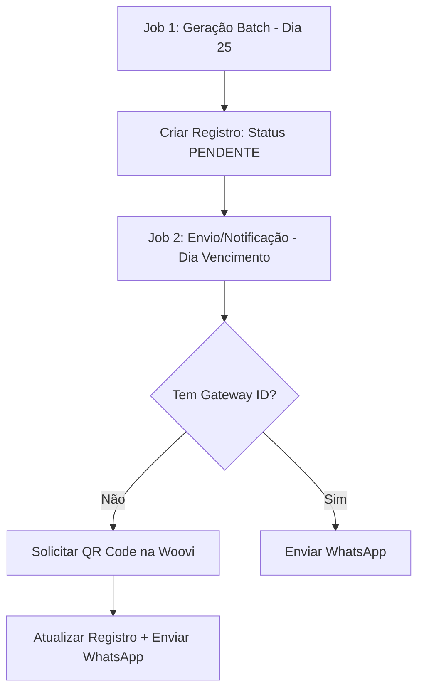

# 🔄 Fluxo Lógico e Máquina de Estados (Cobrança Automática)

Este documento detalha o ciclo de vida técnico de uma cobrança, desde a geração até o repasse final ao motorista, incluindo as travas de inadimplência SaaS.

---

## 1. Máquina de Estados (FSM)

A transição de estados é crucial para auditoria e tratamento de falhas em repasses.

| Estado | Significado | Próximo Passo |
| :--- | :--- | :--- |
| **AGUARDANDO_ENVIO** | Mensalidade registrada internamente (nível 1). | Chegou o dia de envio -> Solicitar QR Code (Woovi). |
| **AGUARDANDO_PAGAMENTO** | Cobrança gerada no Gateway (QR Code ativo). | Pagamento pelo Passageiro -> `PAGO`. |
| **PAGO** | Webhook de confirmação do Provedor recebido. | Iniciar processo de Split/Repasse. |
| **REPASSE_PROCESSANDO** | Dinheiro em trânsito para o banco do motorista (Pix Out em andamento). | Sucesso -> `CONCLUIDO` / Erro -> `REPASSE_FALHA`. |
| **REPASSE_FALHA** | Pix Out rejeitado (ex: Chave PIX deletada/inexistente). | Atualização de Chave -> `REPASSE_PROCESSANDO`. |

> [!TIP]
> **Job de Reconciliação**: Se uma transação permanecer em `REPASSE_PROCESSANDO` por mais de 30 min, o sistema deve consultar o status no gateway via API. Se o gateway confirmar o sucesso, movemos para `CONCLUIDO`. Se o gateway não tiver registro ou informar erro, retrocedemos para `REPASSE_FALHA` para nova tentativa.
| **CONCLUIDO** | Dinheiro no banco do motorista e taxa na Van360. | Estado terminal de sucesso. |
| **CANCELADO** | Cobrança invalidada manualmente ou por nova geração. | Estado terminal. |
| **VENCIDO** | Data limite ultrapassada. | No caso de `COBV`, o PIX já inclui encargos (multa/juros). |

---

## 2. Fluxo de Independência Operacional

Para garantir a saúde financeira da plataforma, a geração de cobranças para passageiros segue este fluxo:

---

## 3. Fluxo de Auto-Recuperação de Chave Pix (Self-healing)

Caso o repasse falhe por chave inválida, o sistema age de forma proativa:

1.  **Detecção**: O Webhook de falha de repasse do Gateway move a transação para `REPASSE_FALHA`.
2.  **Notificação**: O motorista recebe um aviso: *"Repasse travado! Verifique sua chave PIX"*.
3.  **Atualização**: O motorista salva uma nova chave no seu perfil.
4.  **Trigger**: O `UserService` dispara um evento `PIX_KEY_UPDATED`.
5.  **Reprocessamento**: O sistema busca todas as transações em `REPASSE_FALHA` daquele motorista e re-dispara o Repasse pelo Gateway imediatamente.

---

## 4. Pagamento Externo (Manual Override)
Quando o motorista clica em "Recebi por fora":
1.  O sistema chama o endpoint de **Cancelamento** no Gateway (Invalidar QR Code).
2.  O estado no banco local muda para `CANCELADO`.
3.  Um registro no Ledger é criado com `motivo: PAGAMENTO_MANUAL_ESPECIE`.

---

> [!IMPORTANT]
> **Última Atualização**: 2026-04-06
