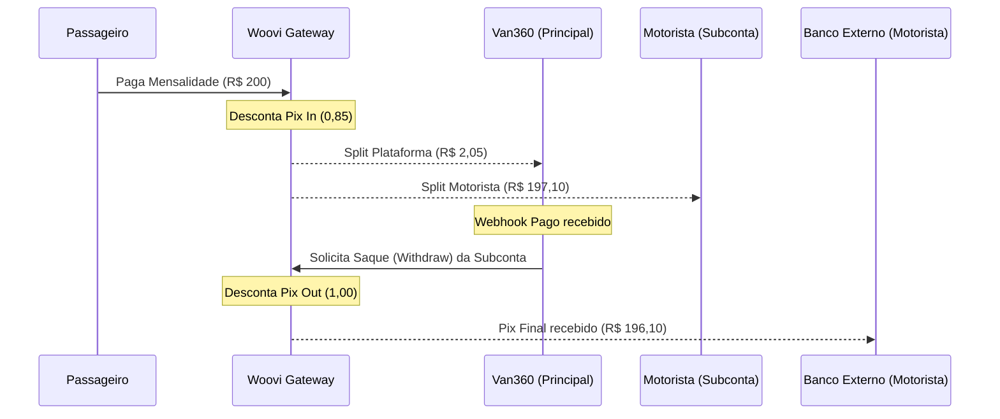

# 💸 Split de Pagamentos e Repasses (Motoristas)

Este documento detalha a engenharia financeira do módulo de cobrança automática, garantindo que as taxas de gateway sejam cobertas e o lucro da Van360 seja preservado de forma dinâmica e agnóstica.

---

## 1. Arquitetura de Divisão (Split)

O sistema utiliza o **Split Nativo** do gateway (Woovi) no momento da criação da cobrança. O objetivo é que a Van360 receba seu lucro na **Conta Principal** e o motorista receba o saldo da mensalidade na sua **Subconta**, já descontadas as taxas.

### 📐 Fórmulas de Cálculo

Para cada transação de mensalidade paga:

1.  **Split do Motorista (Subconta)**:
    > `Valor Pago (Total) - Custos_Gateway_Pix_In (0,85) - Lucro_Van360 (Split_Master)`

2.  **Lucro Líquido Van360 (Split Master)**:
    > `Taxa de Serviço do Motorista - Custos de Gateway Totais (R$ 1,85)`
    > 
    > **Exemplo (Taxa R$ 3,90):** `3,90 - 1,85 = R$ 2,05 (Líquido)`

> [!TIP]
> **Surplus (Juros e Multas)**: Toda e qualquer variação positiva no valor pago (multas e juros por atraso) é direcionada automaticamente para o **Motorista**. A Van360 recebe apenas o seu lucro calculado sobre a taxa de serviço acordada, garantindo transparência e justiça na relação motorista-passageiro.

---

## 2. Parametrizagem das Taxas e Custos

As taxas são divididas em duas camadas para permitir flexibilidade comercial e técnica:

### A. Camada de Negócio (Per Motorista)
Armazenada em `usuarios.config_faturamento` (JSONB):
*   **`taxa_servico_total`**: O valor bruto cobrado do motorista pelo sistema (ex: R$ 3,90).

### B. Camada Técnica (Configurações do Sistema)
Armazenada na tabela **`configuracoes_sistema`** (Chave/Valor):
*   **`billing_gateway_pix_in_fee`**: Custo do recebimento (R$ 0,85).
*   **`billing_gateway_pix_out_fee`**: Custo do saque automático (R$ 1,00).
*   **`billing_gateway_split_fee`**: Taxa de operação de split (**R$ 0,00** — zerado conforme definição).
*   **Custo Operacional Total**: **R$ 1,85** (Soma das taxas de In e Out).

---

## 3. Fluxo de Execução (Cenários de Repasse)

O Van360 suporta duas modalidades de cobrança, dependendo da configuração do passageiro (`repassar_taxa_servico`).

### 🧮 Exemplo Prático (Valores Reais)
**Parâmetros**: Mensalidade: R$ 200,00 | Taxa Van360: R$ 3,90 | Custos Gateway: R$ 1,85.

#### **Cenário A: Taxa Repassada ao Pai (`true`)**
1.  **Pagamento**: O passageiro paga **R$ 203,90** (Mensalidade + Taxa).
2.  **Liquidação + Split**:
    *   **Van360 (Conta Master)**: Recebe **R$ 2,05** (`3,90 - 1,85`).
    *   **Motorista (Subconta)**: Recebe **R$ 201,00** (`203,90 - 0,85 - 2,05`).
    *   **Saque (Pix Out)**: Gateway retém R$ 1,00 no envio.
    *   **Recebimento Final**: O motorista recebe **R$ 200,00** líquidos (100% da mensalidade).

#### **Cenário B: Taxa Assumida pelo Motorista (`false`)**
1.  **Pagamento**: O passageiro paga **R$ 200,00** (Apenas mensalidade).
2.  **Liquidação + Split**:
    *   **Van360 (Conta Master)**: Recebe **R$ 2,05** (Lucro fixo preservado).
    *   **Motorista (Subconta)**: Recebe **R$ 197,10** (`200,00 - 0,85 - 2,05`).
    *   **Saque (Pix Out)**: Gateway retém R$ 1,00 no envio.
    *   **Recebimento Final**: O motorista recebe **R$ 196,10** líquidos (Mensalidade - Custo Plataforma).

> [!CAUTION]
> **Disponibilidade de Saldo**: O Pix Out imediato assume que o saldo na subconta do motorista é liberado instantaneamente pelo gateway após a liquidação do Pix In. Caso o gateway possua um "delay" de liquidação (mesmo de poucos segundos), o sistema deve tratar o erro de saldo insuficiente como um estado temporário e re-tentar o saque via Worker.

---

## 4. Tratamento de Falhas e Idempotência

### ❌ Falha no Pix Out (Repasse Final)
Se a solicitação de saque (`withdraw`) falhar (ex: chave Pix do motorista deletada):
1.  O dinheiro permanece **estacionado com segurança** na subconta do motorista na Woovi.
2.  A transação local no Van360 vai para o estado `REPASSE_FALHA`.
3.  O motorista é notificado para regularizar os dados.
4.  Após a atualização, o sistema dispara novamente os saques pendentes.

### 🛡️ Auditoria no Ledger
Cada liquidação gera um registro no `ledger_faturamento` com o detalhamento das taxas capturadas no momento do pagamento, garantindo rastreabilidade financeira total para o fechamento do mês.

---

> [!IMPORTANT]
> **Agnosticismo**: Caso o gateway seja alterado, basta atualizar os valores na tabela `configuracoes_sistema`. A lógica de negócio e o lucro líquido da plataforma permanecerão íntegros.

---
**Última atualização:** 06 de abril de 2026
